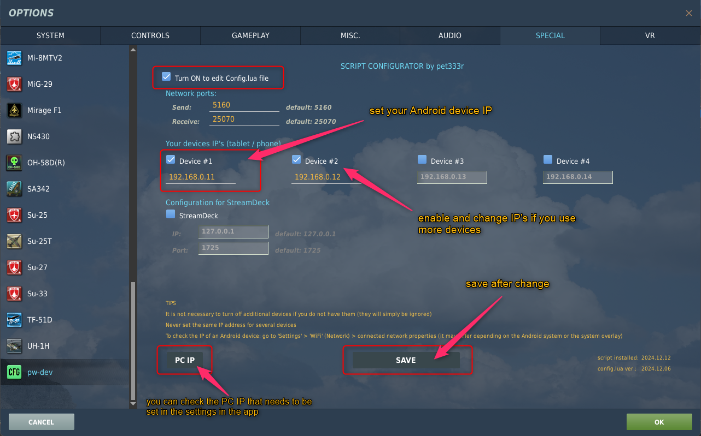

# DCS World Script

Script for exporting data from DCS World

# Table of context
- [DCS World Script](#dcs-world-script)
- [Table of context](#table-of-context)
- [HOW TO INSTALL SCRIPT / Video](#how-to-install-script--video)
- [supported software](#supported-software)
- [automatic script installation](#automatic-script-installation)
- [configure script for DCS World](#configure-script-for-dcs-world)
- [update script](#update-script)
- [files scheme](#files-scheme)
- [manual installation](#manual-installation)
  - [*if you don't have a folder 'Scripts'*](#if-you-dont-have-a-folder-scripts)
  - [*if you have 'Scripts' folder and have installed other scripts*](#if-you-have-scripts-folder-and-have-installed-other-scripts)
  - [*folder scheme*](#folder-scheme)
  - [*edit Config.lua*](#edit-configlua)
- [how to find IP's of PC and Android device](#how-to-find-ips-of-pc-and-android-device)
  - [Android](#android)
  - [PC](#pc)
- [example connection](#example-connection)
- [connection](#connection)
- [features](#features)
  - [additional script functions:](#additional-script-functions)
- [known issues](#known-issues)
- [faq](#faq)
- [compability](#compability)
- [Stream Deck support](#stream-deck-support)
  - [plugin config](#plugin-config)
- [license](#license)

# HOW TO INSTALL SCRIPT / Video
Step by step how to install DCS World script  
* Click on the link or graphic to play the video on YouTube: [https://youtu.be/k6oPIDvX9LQ](https://youtu.be/k6oPIDvX9LQ)

[](https://youtu.be/k6oPIDvX9LQ)

# supported software

[](https://play.google.com/store/apps/details?id=com.dcsufc) 
[](https://play.google.com/store/apps/details?id=com.pwdev.dcsnav) 
[](https://play.google.com/store/apps/details?id=com.dcsaoaindexer) 
[](http://pw-developer.com/soft_dcs_mfd.html)
[](http://pw-developer.com/soft_dcs_fdr.html)

* DCS UFC [https://play.google.com/store/apps/details?id=com.dcsufc](https://play.google.com/store/apps/details?id=com.dcsufc)
* DCS NAV [https://play.google.com/store/apps/details?id=com.pwdev.dcsnav](https://play.google.com/store/apps/details?id=com.pwdev.dcsnav)
* DCS AoA Indexer [https://play.google.com/store/apps/details?id=com.dcsaoaindexer](https://play.google.com/store/apps/details?id=com.dcsaoaindexer)
* DCS World MFD Exporter [http://pw-developer.com/soft_dcs_mfd.html](http://pw-developer.com/soft_dcs_mfd.html)
<!-- * SimFDR [http://pw-developer.com/soft_simfdr.html](http://pw-developer.com/soft_simfdr.html) -->

<!-- [](https://youtu.be/qGfzUdCVLwc)  
[](https://youtu.be/6ang0UBaxTo)  
[](https://youtu.be/OU6KO8tjmGo) -->

<p align="left" width="100%">
  <a href="https://youtu.be/qGfzUdCVLwc"></a>
  <a href="https://youtu.be/6ang0UBaxTo"></a>
  <a href="https://youtu.be/OU6KO8tjmGo"></a>
</p>

# automatic script installation
- download Script Configurator from this link: [https://github.com/pet333r/pw-dev_script/releases/download/configurator/Script.Configurator.zip](https://github.com/pet333r/pw-dev_script/releases/download/configurator/Script.Configurator.zip)
- extract somewhere to disk and run  
- click the "**...**" button to select the path to install the script, the path should look like this:  
  * `c:\Users\{Your username}\Saved Games\DCS.openbeta\`
  * `c:\Users\{Your username}\Saved Games\DCS\`  

  [](https://github.com/pet333r/pw-dev_script/blob/master/.gfx/si01.png) [](https://github.com/pet333r/pw-dev_script/blob/master/.gfx/si02.png)
- after selecting the correct path, click the "**Download & install script**" button, the zip file with the script will be downloaded and installed in the appropriate place, additionally an entry will be automatically added to the main Export.lua file
- then set correct IP addresses of your Android devices in the Config.lua file (you can do this in a few ways):
  - set the IP of your devices on the **CONFIGURATION** tab in app > [configure script in DCS World](#configure-script-for-dcs-world)
  - setting everything up in DCS World > [configure script in DCS World](#configure-script-for-dcs-world)
  - manually editing the file ("**Edit Config.lua**" button) example you will find below in the [example connection](#example-connection)
- in the future, when a script update will be available, you will be able to easily update it by clicking the "**Update script**" button

- the last thing is to enter your computer's IP address in the Android application settings (**DCS UFC** / **DCS NAV** / **DCS AoA Indexer**)

# configure script for DCS World
After installing the script, enter the IP addresses of your Android devices in the `Config.lua` file, you can do this:
  - on the **CONFIGURATION** tab in the application  
   -- change the IP address to the IP address of your device (tablet/phone)    
[](https://github.com/pet333r/pw-dev_script/blob/master/.gfx/si03.png)  
  - in the menu in DCS World `DCS World > Options > Special > pw-dev`
  

# update script

in the application you can also check the version of the script that is installed and whether a newer version is available. In case an update is available, the entire script can be easily updated by clicking the "Update script" button  

&emsp;  

# files scheme

Scheme of folders with installed script
```
DCS or DCS.openbeta
├── Logs
│   └── telemetry                   KML and CSV files are saved here
├── Mods
│   └── Services
│       └── pw-dev
└── Scripts
    ├── Hooks
    │   └── pw_dcs_util-hook.lua
    ├── pw-dev_script
    │   ├── lib\
    │   ├── Modules\                folder with files for individual modules in DCS World
    │   ├── Utilities\              folder with additional software
    │   ├── add_firewall_rules      file adds rules to Windows firewall (if necessary)
    │   ├── Config.lua              main script configuration file
    │   ├── ExportInit.lua
    │   ├── my_local_PC_IP          checking the PC IP address
    │   └── version                 installed script version
    └── Export.lua                  main Export.lua file with entries for additional scripts
```

# manual installation

download latest script version in ZIP file from this link: [https://github.com/pet333r/pw-dev_script/releases/download/script/Scripts-Extended.zip](https://github.com/pet333r/pw-dev_script/releases/download/script/Scripts-Extended.zip), save it wherevere You want on disk and unpack

next go to and open folder: (depending on the DCS World version you have installed..)
* `c:\Users\{Your username}\Saved Games\DCS.openbeta\`
* `c:\Users\{Your username}\Saved Games\DCS\`  
or if you have both, choose one or both DCS versions to install script;-)

## *if you don't have a folder 'Scripts'*

if You don't have folder `Scripts`, simply copy all files from unpacked ZIP file to one of the locations and go to [Edit Config.lua](#edit-configlua)

## *if you have 'Scripts' folder and have installed other scripts*

- copy the `Mods` folder to the above-mentioned folder
- copy `pw-dev_script` and `Hooks` folder from unpacked ZIP file into `Scripts` folder 
- open main `Export.lua` file in `Scripts` folder (recommend Notepad++ for this) and add this code to the beginning of the file (above the entries for other scripts, example here: [compability](#compability)) 

```
pcall(function() local pw=require('lfs');dofile(pw.writedir()..[[Scripts\pw-dev_script\ExportInit.lua]]); end,nil);
```
- save & close
- now go to [Edit Config.lua](#edit-configlua)

## *folder scheme*

this is what the scheme of the folder with the script installed should look like (depending on the DCS version)
folder `Scripts`  
  
folder `pw-dev_script` inside `Scripts`  


## *edit Config.lua*
in folder `pw-dev_script` open `Config.lua` for edit, there are several "groups" in the file: 

```
-- device 1
PWDEV.Config.Device[1] = {}
PWDEV.Config.Device[1].Export = true;           -- set to true if you want to send data to this device
PWDEV.Config.Device[1].Host = "192.168.0.11"    -- IP for 1st app
```

choose one of them and edit `Host` by changing the IP address to the IP address of your device to which the data is to be sent  
it is <span style="color:red">**IMPORTANT**</span> that the device's IP address matches and `PC / phone / tablet` must be on the same network  

example you will find below in the [example connection](#example-connection)

# how to find IP's of PC and Android device

## Android
To find Android device IP: on device go to `Settings > WiFi` > check the properties of your network (it may be different on different Android devices / versions / system overlays)   

## PC
to find the IP address of your PC with DCS World installed: [https://www.digitalcitizen.life/find-ip-address-windows](https://www.digitalcitizen.life/find-ip-address-windows)  
or run `my_local_PC_IP.cmd` file in script folder or click on the `PC IP` button on the script configuration panel in DCS World, a console window will open  

example:  
[](.gfx/ipconfig.png)  


# example connection
Example configuration:  
PC IP: 192.168.0.10  
Android device IP: 192.168.0.12  


# connection

***`1`*** if your network structure is more complicated than a (PC -> router <- Android device), devices may not be able to "see" each other because each belongs to a different subnet of the router, this must be changed in the router settings

***`2`*** it's best to assign a static IP address to your Android device's router (the router will always assign the same IP address to a device on your network)

***`3`*** the application works on these ports by default:
  - **5160** UDP : output port from PC (this port is used to send data from DCS to Android or applicastion in the network)
  - **25070** UDP : input port on PC (listening for information received from Android or an application in the network)

***`4`*** where to enter the IP address of the device to which I want to send the data from the script?  
In one of the "groups" in the Config.lua file which is located in the folder with the script. Never enter the same IP address in several groups with the same port number, it may block data transfer on this port.


# features
## additional script functions:

***`1`*** saving telemetry data to **KML** and **CSV** files, files are saved in one of the folders (depending on your DCS World version)  
  * `c:\Users\{Your username}\Saved Games\DCS.openbeta\Logs\telemetry\`
  * `c:\Users\{Your username}\Saved Games\DCS\Logs\telemetry\`  

    `1.1` **KML file** (the file can be opened in any application that supports that file format):
  

  `1.2` **CSV file** : an additional application is required to open the file and view the saved data, which can be downloaded from this link:: [https://www.dropbox.com/s/piif8wybqlp4okq/DCS_FDR_Viewer.zip](https://www.dropbox.com/s/piif8wybqlp4okq/DCS_FDR_Viewer.zip) App displays the flight route in a 3D view and others data on 2D graphs


  <p align="left" width="100%">
    
    
  </p>

# known issues

***`1`*** If You can interact with DCS but not receiving data  
  - You probably set wrong Your Android device IP in `Config.lua` file

***`2`*** If Your device stopped receiving data
  - Your router has likely assigned a different IP address to your Android device. Check the device's IP address and enter a new one in the `Config.lua` file.

***`3`*** If you receive data from DCS but no button works  
  - check if you have the correct PC address given in the DCS UFC settings  
  - your firewall probably blocking incomming connections, turn off the firewall for a few minutes and check if everything works (to unblock the default ListenerPort: 25070 / UDP)  
  [https://www.windowscentral.com/how-open-port-windows-firewall](https://www.windowscentral.com/how-open-port-windows-firewall)

# faq
***`1`*** What are the minimum Android versions for each app? [ `DCS UFC` / `DCS Nav` / `DCS AoA Indexer`]
  - DCS UFC: Android 4.1 and above
  - DCS Nav: Android 7.0 and above
  - DCS AoA Indexer: Android 4.4 and above

***`2`*** do the applications and script work in multiplayer?
  - YES, on the server the property must be set: `Allow player export: yes`, most servers have this option enabled;-)

***`3`*** does integrity check pass?
  - YES (more precisely, it doesn't even have any effect on it :-) )

***`4`*** are there any limitations to the DCS World version with which the apps work?
  - NONE, the applications work with any version of DCS World, no matter if it is a standalone or openbeta version, and whether it was installed directly from the producent website or you use the Steam version

# compability
Script may not work with some other scripts if they use similar solutions to connect to external applications. This is a known problem in DCS.  
If you noticed that something is not working and you are also using other scripts, put other scripts in the comment (add `--` at the beginning of the entry) to check which ones do not want to work with each other.  

tested and works with :
 * DCS-BIOS
 * Tacview  
 * VAICOM PRO
 * SRS

 for users using SRS and VaicomPro (works when the script entry is "higher" in the file, above the SRS / VaicomPro entry)  
 example of the main `Export.lua` file (thanks to one user: `Arsenio`)
 ```
pcall(function() local pw=require('lfs');dofile(pw.writedir()..[[Scripts\pw-dev_script\ExportInit.lua]]); end,nil);

local vaicomlfs = require('lfs'); dofile(vaicomlfs.writedir()..[[Scripts\VAICOMPRO\VAICOMPRO.export.lua]]);

pcall(function() local dcsSr=require('lfs');dofile(dcsSr.writedir()..[[Mods\Tech\DCS-SRS\Scripts\DCS-SimpleRadioStandalone.lua]]); end,nil);

local Tacviewlfs=require('lfs');dofile(Tacviewlfs.writedir()..'Scripts/TacviewGameExport.lua');
 ```


# Stream Deck support

For the script to work properly with StreamDeck, a plugin for the Elgato StreamDeck software must be installed, more information can be found here:
[https://github.com/charlestytler/streamdeck-dcs-interface](https://github.com/charlestytler/streamdeck-dcs-interface)

* To install the DCS Interface Streamdeck plugin, you will need to download and run the installer `com.ctytler.dcs.streamDeckPlugin` from [This page](https://github.com/charlestytler/streamdeck-dcs-interface/releases)

## plugin config
- IP Address: `127.0.0.1`
- Listener Port: `1725` (default)
- Send Port: `25070` (the same as in the `Config.lua` file > `PWDEV.Config.ListenerPort`)


:red_circle: <span style="color:#FF4422">IMPORTANT</span>
The script does not send all the data from the modules available for DCS World. Therefore, not every available 'option' will be transferred between DCS World and StreamDeck (if you use any ready-made configurations found on the Internet). This is because the `DCS UFC` application does not need all this data and there is no need to send it additionally (it only increases the network traffic)  

# license

The script is available free of charge under the LGPLv3 license.  
Part of the script was based on DCS-ExportScripts 
Additional functionality was added and modified to increase performance and separate sending of individual data to reduce the load on the application.