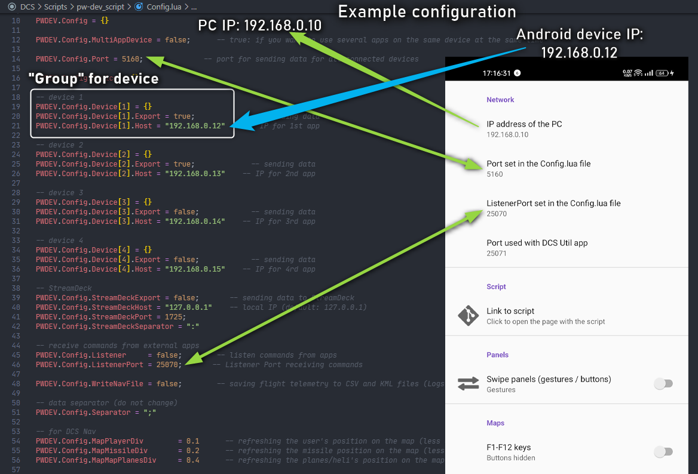

# DCS World Script

Script for exporting data from DCS World

# HOW TO INSTALL SCRIPT > Video
Step by step how to install DCS World script  
### Click on the link or graphic to play the video on YouTube: [https://youtu.be/saFq3Png-ds](https://youtu.be/saFq3Png-ds)

[](https://youtu.be/saFq3Png-ds)

# latest script version in zip file
if you have any problem understanding how the DCS World script should be installed, download the zip file, it contains a schematic of the entire `Scripts` folder along with the main `Export.lua` file and the entire script

you'll find it on the "Releases" page
[https://github.com/pet333r/pw-dev_script/releases](https://github.com/pet333r/pw-dev_script/releases)

# supported software

[](https://play.google.com/store/apps/details?id=com.dcsufc) 
[](https://play.google.com/store/apps/details?id=com.dcsaoaindexer) 
[](http://pw-developer.com/soft_dcs_mfd.html)

* DCS UFC [https://play.google.com/store/apps/details?id=com.dcsufc](https://play.google.com/store/apps/details?id=com.dcsufc)
* DCS AoA Indexer > [https://play.google.com/store/apps/details?id=com.dcsaoaindexer](https://play.google.com/store/apps/details?id=com.dcsaoaindexer)
* DCS World MFD Exporter [http://pw-developer.com/soft_dcs_mfd.html](http://pw-developer.com/soft_dcs_mfd.html)
* SimFDR [http://pw-developer.com/soft_simfdr.html](http://pw-developer.com/soft_simfdr.html)

[](https://youtu.be/qGfzUdCVLwc)  
[](https://youtu.be/OU6KO8tjmGo)

# automatic script installation
- download Script Configurator from this link: [https://github.com/pet333r/pw-dev_script/releases/download/configurator/Script.Configurator.zip](https://github.com/pet333r/pw-dev_script/releases/download/configurator/Script.Configurator.zip)
- extract to disk somewhere and run  
- click the "**...**" button to select the path to install the script (the path should look like this:)  
  * `c:\Users\{Your username}\Saved Games\DCS.openbeta\`
  * `c:\Users\{Your username}\Saved Games\DCS\`  

  [](https://github.com/pet333r/pw-dev_script/blob/master/.gfx/sc1.png) [](https://github.com/pet333r/pw-dev_script/blob/master/.gfx/sc2.png)
- after selecting the correct path, click the "**Download & install script**" button, the zip file with the script will be downloaded and installed in the appropriate place, additionally an entry will be automatically added to the main Export.lua file
- you can check if the script entry is added in the file Export.lua (button "**Open main Export.lua**")
- then enter the correct IP addresses of your Android devices ("**Edit Config.lua**" button) example you will find below in the [example connection](#example-connection)
- in the future, you can check the script update by clicking the "**Check for update**" button

- the last thing is to enter your computer's IP address in the Android application settings (**DCS UFC** / **DCS AoA Indexer**)

# manual installation

download latest script version in ZIP file from this link: [https://github.com/pet333r/pw-dev_script/releases/download/script/Scripts.zip](https://github.com/pet333r/pw-dev_script/releases/download/script/Scripts.zip), save it wherevere You want on disk and unpack

next go to and open folder: (depending on the DCS World version you have installed..)
* `c:\Users\{Your username}\Saved Games\DCS.openbeta\Scripts\`
* `c:\Users\{Your username}\Saved Games\DCS\Scripts\`  
or if you have both, choose one or both DCS versions to install script;-)

## if you don't have a folder "Scripts"

if You don't have folder `Scripts`, simply copy folder `Scripts` from unpacked ZIP file to one of the locations and go to [Edit Config.lua](##edit-Config.lua)

## if you have "Scripts" folder and have installed other scripts

- copy `pw-dev_script` folder from unpacked ZIP file into `Scripts` folder 
- open main `Export.lua` file in `Scripts` folder (recommend Notepad++ for this) and add this code to the beginning of the file (above the entries for other scripts, example here: [compability](#compability)) 

```
pcall(function() local pw=require('lfs');dofile(pw.writedir()..[[Scripts\pw-dev_script\ExportInit.lua]]); end,nil);
```
- save & close
- now go to [Edit Config.lua](##edit-Config.lua)

## files scheme

this is how the file scheme with folders should look

```
\Scripts
  - \pw-dev_script
    - \lib
    - \Modules
    -  Config.lua (edit IP / port connected devices)
    -  ExportInit.lua

  - Export.lua add:  pcall(function() local pw=require('lfs');dofile(pw.writedir()..[[Scripts\pw-dev_script\ExportInit.lua]]); end,nil);
  ```

should look like this (depending on the DCS version)  
folder `Scripts`  
  
folder `pw-dev_script` inside `Scripts`  


## edit Config.lua 
in folder `pw-dev_script` open `Config.lua` for edit, there are several "groups" in the file: 
* device 1
* device 2
* device 3
* device 4

choose one of them and edit `Host` and `Port` (you can leave port the same, in 99% cases you don't even need to change)  
it is <span style="color:red">**IMPORTANT**</span> that the device's IP address matches and `PC / phone / tablet` must be on the same network  

<!-- ### configuration for apps
- if You only use `DCS UFC` [https://play.google.com/store/apps/details?id=com.dcsufc](https://play.google.com/store/apps/details?id=com.dcsufc) set `ExportSelfData` to `false` (less data to be sent and processed by the application, longer battery life)
```
ExportScript.Config.ExportSelfData          = false
```
- `DCS AoA Indexer` [https://play.google.com/store/apps/details?id=com.dcsaoaindexer](https://play.google.com/store/apps/details?id=com.dcsaoaindexer) must have `ExportSelfData` and `ExportXSD` set to `true` for proper working
```
ExportScript.Config.ExportXSD               = true (where X is Your device group to which the IP of the device from the DCS AoA Indexer is assigned)
...
ExportScript.Config.ExportSelfData          = true
``` -->

example you will find below in the [example connection](#example-connection)


# automatic update script

in the future, just run the file `update_pw-dev_script.bat` to download the latest version of the script (the `Config.lua` file will be kept, the others will be replaced with the latest version)  
just run it from time to time or add a shortcut in the Windows Startup folder to have the script updated during system startup


# how to find IP's of PC and Android device

## Android
To find Android device IP: go to `Settings > WiFi` > check the properties of your network   

## PC
to find the IP address of the computer with DCS World installed: [https://www.digitalcitizen.life/find-ip-address-windows](https://www.digitalcitizen.life/find-ip-address-windows)  
or run `my_local_PC_IP.cmd` file in script folder, a console window will open  

example:  
[](.gfx/ipconfig.png)  


# example connection
Example configuration:  
PC IP: 192.168.0.10  
Android device IP: 192.168.0.12  



# connection

***`1`*** if your network structure is more complicated than a (PC -> router <- Android device), devices may not be able to "see" each other because each belongs to a different subnet of the router, this must be changed in the router settings

***`2`*** it's best to assign a static IP address to your Android device's router (the router will always assign the same IP address to a device on your network)

***`3`*** the application works on these ports by default:
  - 5160 UDP : output port from PC (this port is used to send data from DCS to Android or applicastion in the network)
  - 25070 UDP : input port on PC (listening for information received from Android or an application in the network)

***`4`*** where to enter the IP address of the device to which I want to send the data from the script?  
In one of the "groups" in the Config.lua file which is located in the folder with the script. Never enter the same IP address in several groups with the same port number, it may block data transfer on this port.


# features
## additional script functions:

***`1`*** saving telemetry data to KML and CSV files, files are saved in one of the folders (depending on your DCS World version)  
  * `c:\Users\{Your username}\Saved Games\DCS.openbeta\Logs\`
  * `c:\Users\{Your username}\Saved Games\DCS\Logs\`  
  - KML file (the file can be opened in any application that supports that file format):
  
# known issues

***`1`*** If You can interact with DCS but not receiving data  
  - You probably set wrong Your Android device IP in `Config.lua` file

***`2`*** If Your device stopped receiving data
  - Your router has likely assigned a different IP address to your Android device. Check the device's IP address and enter a new one in the Config.lua file.

***`3`*** If you receive data from DCS but no button works  
  - check if you have the correct PC address given in the DCS UFC settings  
  - your firewall probably blocking incomming connections, turn off the firewall for a few minutes and check if everything works (to unblock the default ListenerPort: 25070 / UDP)  
  [https://www.windowscentral.com/how-open-port-windows-firewall](https://www.windowscentral.com/how-open-port-windows-firewall)

# faq
***`1`*** What version of the system do Android applications work with? [ DCS UFC / DCS AoA Indexer]
  - applications run on systems version 4.1 and above [ about 99% of devices available on the market ]

***`2`*** do the applications and script work in multiplayer?
  - YES, on the server the property must be set: `Allow player export: yes`, about 95% of servers have this option turned on;-)

***`3`*** does integrity check pass?
  - YES (more precisely, it doesn't even have any effect on it :-) )

# compability
Script may not work with some other scripts if they use similar solutions to connect to external applications. This is a known problem in DCS.  
If you noticed that something is not working and you are also using other scripts, put other scripts in the comment (add -- at the beginning of the entry) to check which ones do not want to work with each other.  

tested and works with :
 * DCS-BIOS
 * Tacview  
 * VAICOM PRO
 * SRS

 for users using SRS and VaicomPro (works when the script entry is "higher" in the file, above the SRS / VaicomPro entry)  
 example of the main `Export.lua` file (thanks to one user: `Arsenio`)
 ```
pcall(function() local pw=require('lfs');dofile(pw.writedir()..[[Scripts\pw-dev_script\ExportInit.lua]]); end,nil);

local vaicomlfs = require('lfs'); dofile(vaicomlfs.writedir()..[[Scripts\VAICOMPRO\VAICOMPRO.export.lua]]);

pcall(function() local dcsSr=require('lfs');dofile(dcsSr.writedir()..[[Mods\Tech\DCS-SRS\Scripts\DCS-SimpleRadioStandalone.lua]]); end,nil);

local Tacviewlfs=require('lfs');dofile(Tacviewlfs.writedir()..'Scripts/TacviewGameExport.lua');
 ```

# license

The script is available free of charge under the LGPLv3 license.  
Part of the script was based on `DCS-ExportScripts` 
Additional functionality was added and modified to increase performance and separate sending of individual data to reduce the load on the application.